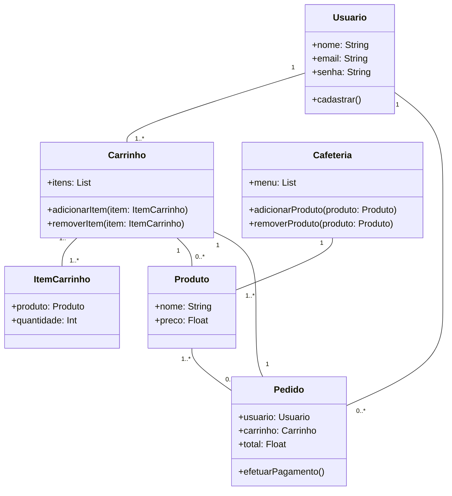

# Cafeteria
Projeto em vite  utilizando react para uma cafeteria

# ferramentas:

```
npm install
```

```
npm run dev
```

# Diagrama:


```mermaid
classDiagram
  class Usuario {
    +nome: String
    +email: String
    +senha: String
    +cadastrar()
  }

  class Carrinho {
    +itens: List<ItemCarrinho>
    +adicionarItem(item: ItemCarrinho)
    +removerItem(item: ItemCarrinho)
  }

  class ItemCarrinho {
    +produto: Produto
    +quantidade: Int
  }

  class Produto {
    +nome: String
    +preco: Float
  }

  class Cafeteria {
    +menu: List<Produto>
    +adicionarProduto(produto: Produto)
    +removerProduto(produto: Produto)
  }

  class Pedido {
    +usuario: Usuario
    +carrinho: Carrinho
    +total: Float
    +efetuarPagamento()
  }

  Usuario "1" -- "1..*" Carrinho
  Carrinho "1..*" -- "1..*" ItemCarrinho
  Carrinho "1" -- "0..*" Produto
  Usuario "1" -- "0..*" Pedido
  Pedido "1" -- "1" Carrinho
  Produto "1..*" -- "0..*" Pedido
  Cafeteria "1" -- "1..*" Produto

```
